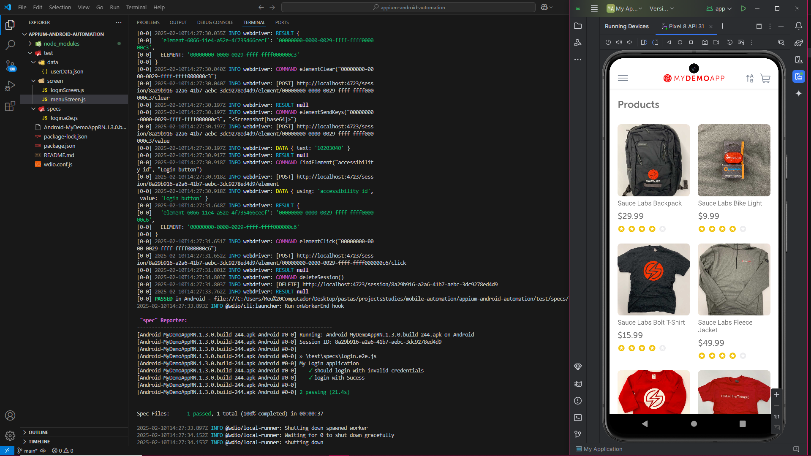

# Appium Android Automação



Projeto automação mobile android com appium de um aplicativo "Sauce Demo App" utilizando 
arquitetura de screen pages. Testes implementados a penas para feature 
login failure e sucess , estrura reutilizaveis , garantindo eficiência e
qualidade.

A proposta é aumentar a precisão e a eficiência dos processos de QA em aplicativos Android, 
utilizando técnicas avançadas de automação e adotando as melhores práticas em testes de software.


## 📋 Pré-requisitos

> **💡 NOTA:**
> 
> È necessário ter o instalado
> 

Certifique-se de ter os seguintes componentes instalados para executar este projeto:

- [Node.js (v14 ou superior)](https://nodejs.org/)
- [Appium (última versão)](https://appium.io/docs/en/about-appium/intro/)
- [Java Development Kit (JDK) (v8 ou superior)](https://www.oracle.com/java/technologies/javase-downloads.html)
- [Android Studio (com Android SDK configurado)](https://developer.android.com/studio)
- [Python (opcional para scripts adicionais)](https://www.python.org/downloads/)
- Dispositivo físico ou [Emulador Android](https://developer.android.com/studio/run/emulator) configurado para testes


## 📝 Passo a Passo para Instalação


**1.** **Clone o repositório na sua maquina 🖥️**

```bash
git clone https://github.com/ElizabethGomes-QAEngineer/mobile-appium-automacao.git
```

**2.** **Navegue até o diretório do projeto 📂**

```bash
cd appium-android-automation
````


**3.** **Instale as dependências do projeto 📦**

```bash
npm install -g appium
```

**4.** **Inicie o servidor Appium 🚀**

```bash
appium
```

> **💡 NOTA:**
> **5** **Conecte ao seu dispositivo Android ou apenas inicie um emulador**
> 


**6.** **Execute executa o WebdriverIO run 🚀**


```bash
npx wdio
````


> 
> **💡 NOTA:** **1. Configuração: abrir o android usar o emulator "Pixel 8 API 31" após dar run ,no vs code digite a porta do inspector***
> 
´´´bash
appium -p 4723
```
> após iniciar a porta no git bash execute o inspector e clique em "start session"
> quando o app abrir no emulator  
> usar o comando
´´´bash
npx wdio
´´´


